# Fitbit Dataset Analysis

**Author**: Harry Stuart Curtis

**Published**: 2023-06-05

**Last Updated**: 2024-01-02

## Contents

1. [Introduction](#introduction)
2. [Method](#methodology)
3. [Results](#results)
    1. [Daily Averages](#daily-averages)
    2. [Minute-Level Data](#minute-level-data)
    3. [Sleep Data](#sleep-data)
    4. [Weight Data](#weight-data)
    5. [Heart Rate Data](#heart-rate-data)
4. [Insights & Recommendations](#insights--recommendations)
5. [Conclusion](#conclusion)

## Introduction

In this analysis, I examine the data from a Kaggle dataset to find insights that would be of use to Bellabeat, a fictional company that provides health-oriented smart devices to women. The data from the analysis refers to the period from 12 April until 12 May 2016, and contains data collected from 33 Fitbit users. Fitbit is an American company that manufactures wearable technology for activity tracking. As of 2016, they had the largest share of the global wearables market. Bellabeat also produces a number of smart devices, and hopes to learn how consumers use their wearables from this dataset.

## Methodology

[*See the Jupyter Notebook in this repository for the methodology for this case study.*](methodology.ipynb)

## Results

### Daily Averages

#### Research Questions

1. [What percentage of users manually added exercise data for distance travelled?](#what-percentage-of-users-manually-added-exercise-data-for-distance-travelled)
2. [On average, what percentage of the day did each user spend sedentary?](#on-average-what-percentage-of-the-day-did-each-user-spend-sedentary)
3. [How many calories did each user expend on average every day?](#how-many-calories-did-each-user-expend-on-average-every-day)
4. [What was the average distance travelled by each user every day?](#what-was-the-average-distance-travelled-by-each-user-every-day)
5. [How many steps did each user take per day on average?](#how-many-steps-did-each-user-take-per-day-on-average)
6. [How did the daily averages for calories expended, proportion of time spent sedentary, total distance travelled, and total steps taken change across all users during the one month period?](#how-did-the-daily-averages-for-calories-expended-proportion-of-time-spent-sedentary-total-distance-travelled-and-total-steps-taken-change-across-all-users-during-the-one-month-period)

#### What percentage of users manually added exercise data for distance travelled?

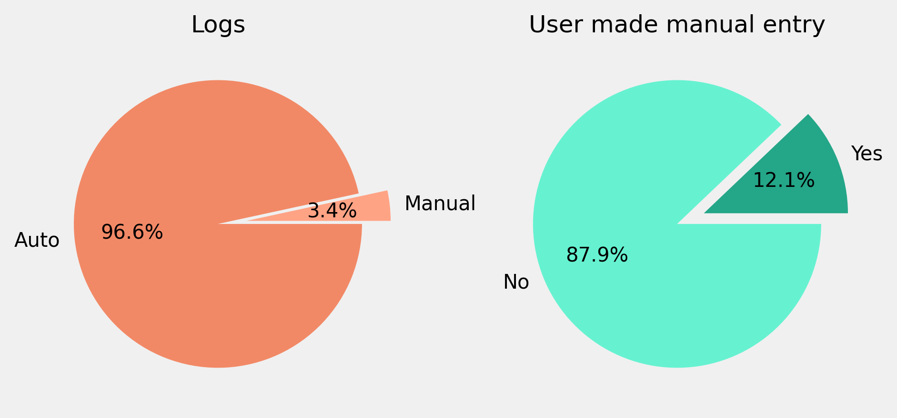

Few users made manual adjustments to their exercise data. 3.4 % of the logs were manual entries, and were made by 12.1 % of users (4 users).

#### On average, what percentage of the day did each user spend sedentary?

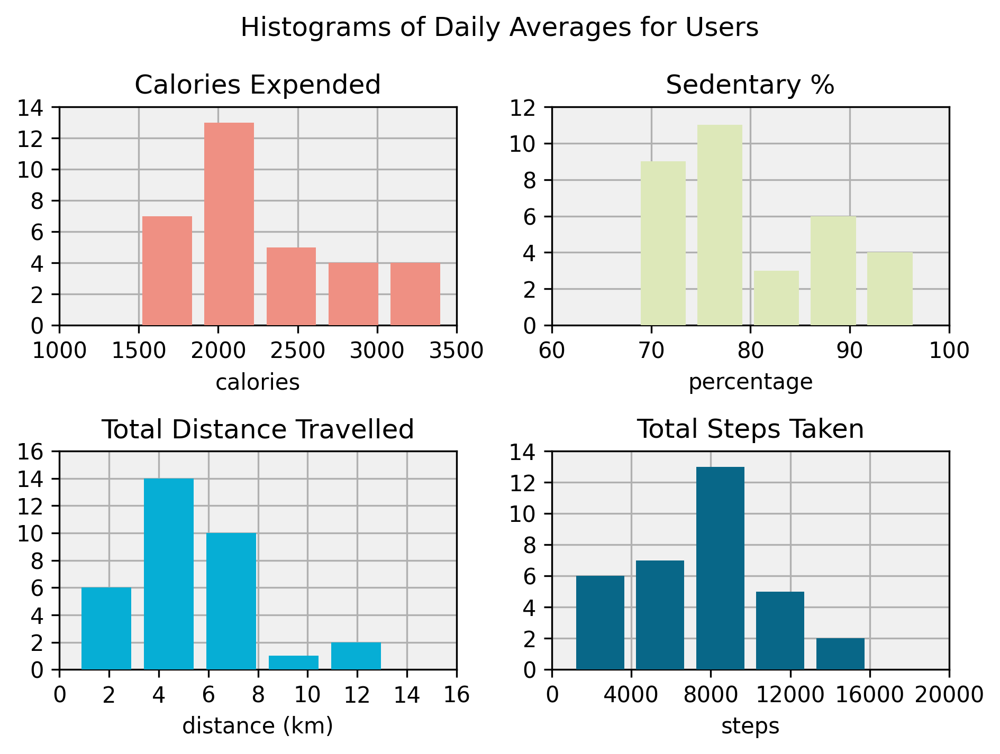

Users spent an average of 80 % of their waking hours sedentary, with just over two-thirds of users falling within the range of 72-88 % (1 standard deviation above and below the mean). The least active user spent 97 % of their time sedentary, while the most active user spent 68 %.

#### How many calories did each user expend on average every day?

On average, users expended just under 2300 calories per day, with most users averaging between 1750 and 2800. Several users expended many more calories, with the highest averaging just over 3400 per day. The lowest average calories expended per day was just under 1500.

#### What was the average distance travelled by each user every day?

There was a lot of variance in the average distance travelled by each user per day. On average, people walked 5.4 km every day, but that could vary from 2.5 to 8.2 km for the majority of the users. The lowest average was 0.6 km per day and the highest was 13.2.

#### How many steps did each user take per day on average?

Similarly, the average number of steps taken per day was also varied. Although the average was 7500 steps, for most users it ranged from 4000 to 11,000 steps. One user averaged 16,000 steps per day, while the lowest average was just over 900.

#### How did the daily averages for calories expended, proportion of time spent sedentary, total distance travelled, and total steps taken change across all users during the one month period?

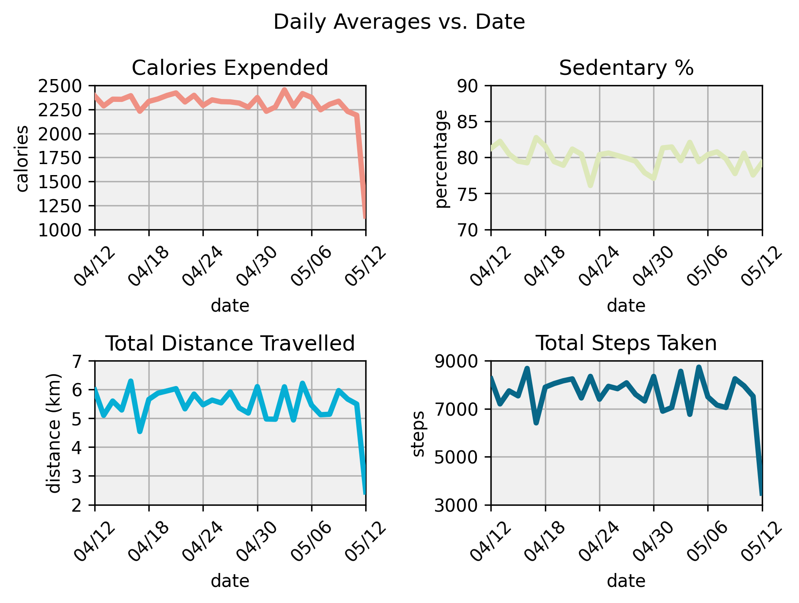

The graphs show no trends in the averages across users during the month. On 15 May, there is a noticeable dip, but that is likely because of missing data for that day.

### Minute-Level Data

#### Research Questions

1. [How did the average MET rating, intensity of physical activity, number of steps taken and number of calories expended change throughout the day?](#how-did-the-average-met-rating-intensity-of-physical-activity-number-of-steps-taken-and-number-of-calories-expended-change-throughout-the-day)
2. [What was the average activity intensity score per minute? What was the average MET rating per minute?](#what-was-the-average-activity-intensity-score-per-minute-what-was-the-average-met-rating-per-minute)

#### How did the average MET rating, intensity of physical activity, number of steps taken and number of calories expended change throughout the day?

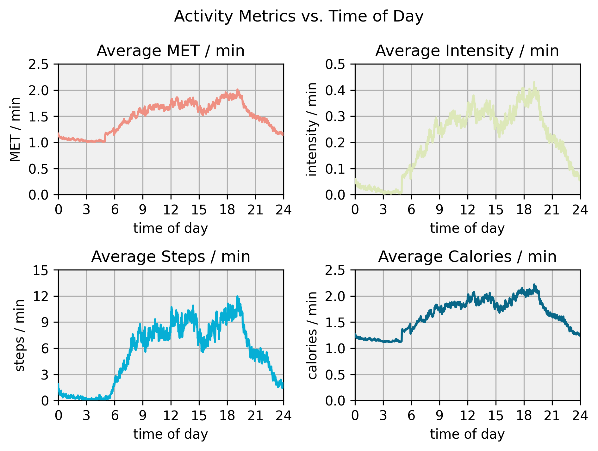

The graphs show clear and distinct trends in physical activity throughout the day. Users were essentially inactive between midnight and 5 a.m., but then physical activity increased sharply from 5 a.m. to 9 a.m. Between mid-morning and the early afternoon, from 9 a.m. until around 2 p.m., the users tended to become more and more active, but more gradually than in the early morning. There was a sharp dip in activity in the post-lunch period, from 2 p.m. until 3 p.m., but between 3 p.m. and 7 p.m., physical activity then continued to rise somewhat sharply. In the evening, between 7 p.m. and midnight, users wound down until reaching the neglible levels of activity previously described.

#### What was the average activity intensity score per minute? What was the average MET rating per minute?

The graph below shows two histograms describing the frequency distributions of average exercise intensity and MET rating. The physical activity scores represent the total score from a user's active time divided by the number of minutes they were active. A higher rating indicates that a user spent more time performing intense activity, while a lower score indicates that the user spent more time sedentary. The MET rating represent a similar relationship to activity intensity.

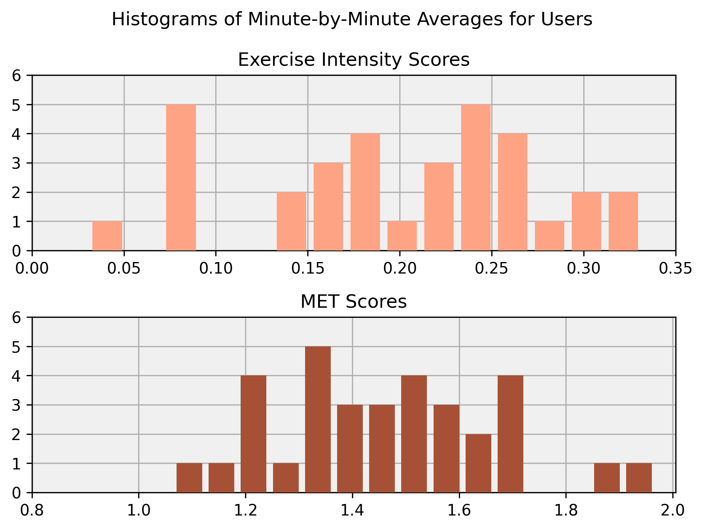

Examining the minute-by-minute averages for activity intensity, we see that there are three peaks. There are two broad peaks above and below the mean, near 0.18 and 0.24, and a another peak far below the mean near 0.08. Given the range (0.03-0.33) and the standard deviation (0.08), we can see that the average physical activity was quite varied, with many users deviating far from the mean. One outlier had a particularly low average activity intensity score of 0.03. Overall, there were no clear patterns in the physical activity scores of the users during the sample period.

The MET ratings were slightly less varied, tending to be within 0.2 METs of the mean 1.5. However, there were two potential outliers who were quite active in comparison to the rest of the sample, with ratings of around 1.9 METs.

### Sleep Data

#### Research Questions

1. [What was the average duration of each user's sleep session?](#what-was-the-average-duration-of-each-users-sleep-session)
2. [What was the average number of sleep logs recorded per user?](#what-was-the-average-number-of-sleep-logs-recorded-per-user)
3. [Was there a relationship between the number of sleep sessions logged and the average duration of a sleep session?](#was-there-a-relationship-between-the-number-of-sleep-sessions-logged-and-the-average-duration-of-a-sleep-session)

#### What was the average duration of each user's sleep session?

24 users measured their sleep at some point during the sample period. On average, the users slept for 6.4 hours (6 hours 24 minutes) and recorded 19 sleep logs. All of the users that had an extremely high or low average sleep duration also recorded substantially fewer sleep logs than the average. Besides the outlying averages for sleep duration, there were also five users that had more sleep logs than there were days in the sample period.

The first histogram below ("Histogram of Average Sleep Duration") shows the frequency distribution of users by average sleep duration. From the graph, we can detect the indicative bell shape of a normal distribution near the mean, with most users averaging between 4.5 and 9 hours. There are some outliers above and below the curve, with three users averaging as little as 2 hours of sleep per night, and one user averaging 16 hours.

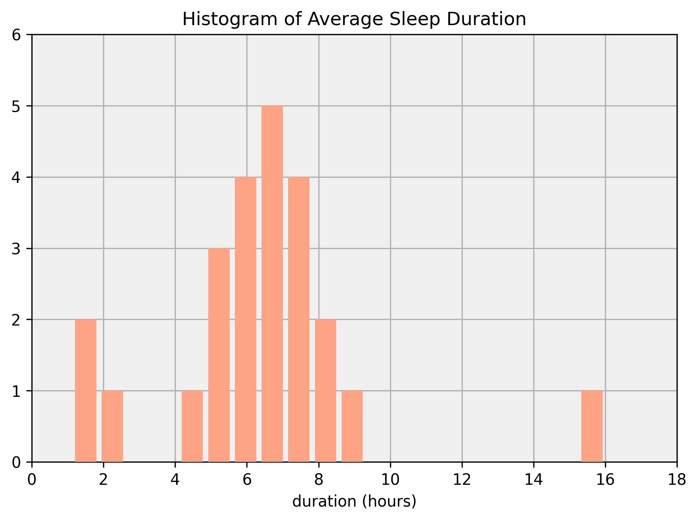

#### What was the average number of sleep logs recorded per user?

Next, we have a histogram showing the number of sleep sessions logged per user. Here, the graph has three peaks: a medium-sized group of users on the left that did not record many sleep sessions; a pair of users that logged 15 sleep sessions; and a large group that recorded many sleep sessions.

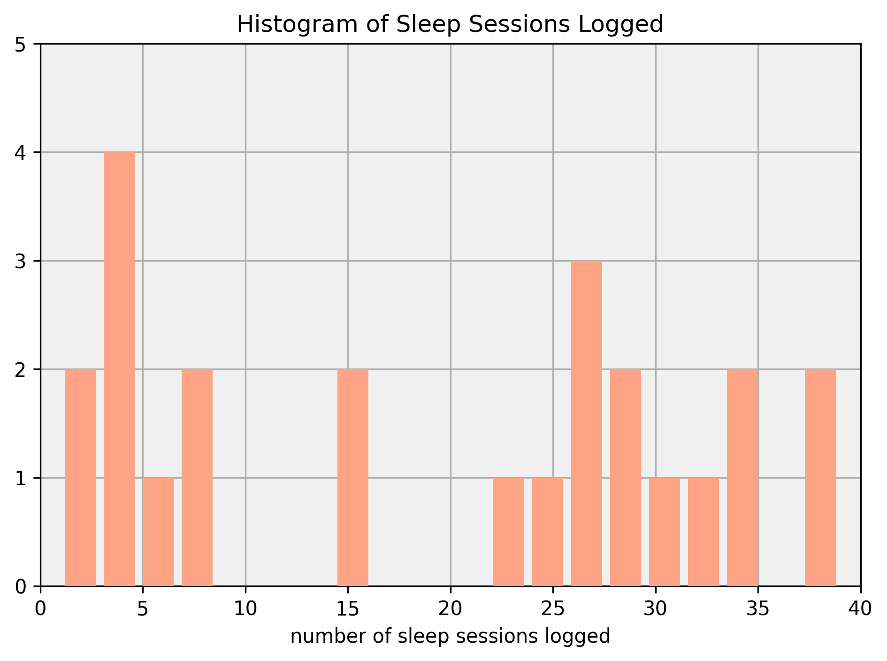

#### Was there a relationship between the number of sleep sessions logged and the average duration of a sleep session?

Finally, we have a scatter plot that shows the relationship between the number of logs and the average duration of the user's sleep session. The line shows a quadratic relationship (i.e. the rate of change itself changes). As the number of measurements increased, the user tended to sleep for longer, until it reached around 20 measurements in the month period. After that, the effect of measuring more sleep cycles began to correlate with a decrease in the amount of time a user slept.

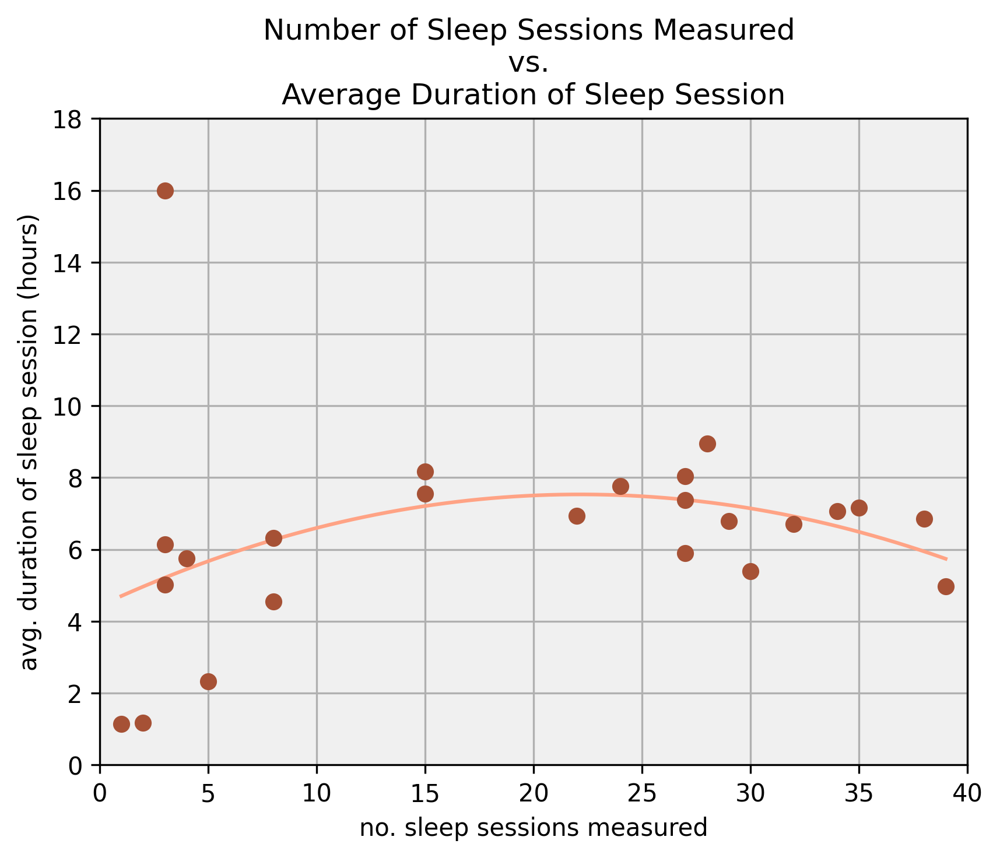

### Weight Data

#### Research Questions

1. [How many of the users in the sample measured their weight?](#how-many-of-the-users-in-the-sample-measured-their-weight)
2. [How did the weight of the users change?](#how-did-the-weight-of-the-users-change)
3. [Was there a correlation between the number of weight measurements and the change in weight for each user?](#was-there-a-correlation-between-the-number-of-weight-measurements-and-the-change-in-weight-for-each-user)

#### How many of the users in the sample measured their weight?

Of the 33 users in the sample, 8 took at least one weight measurement during the sample period. From those eight, only five made more than one weight measurement.

#### How did the weight of the users change?

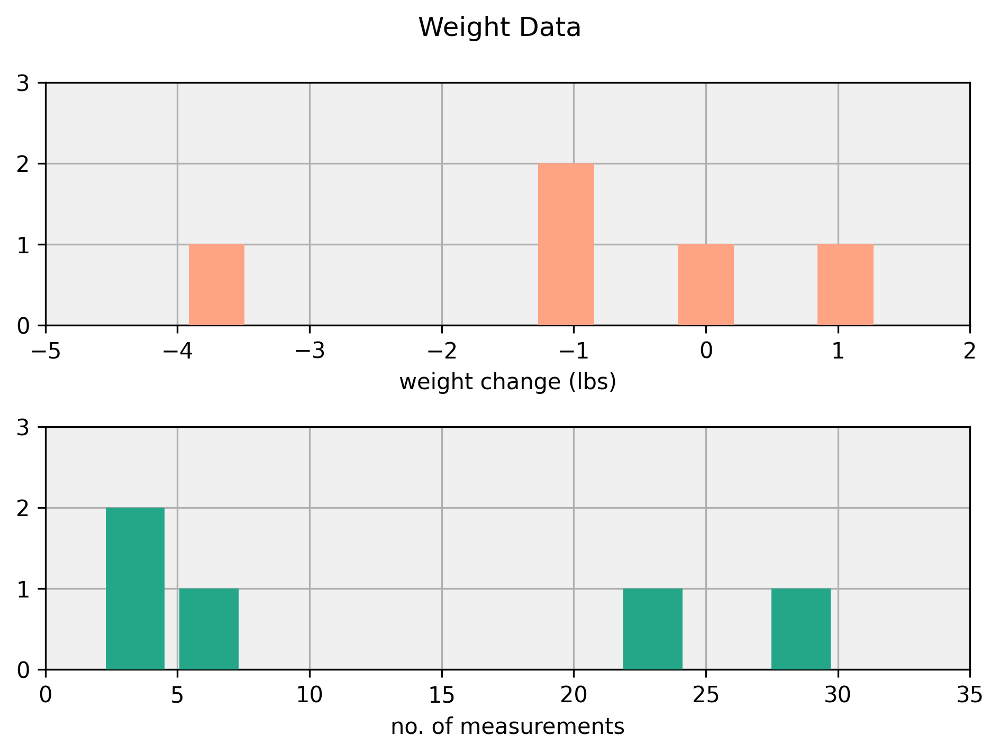

The users that monitored their weight during the sample period and made more than one measurement lost an average of 1.1 lbs. One user gained weight during the period (1.3 lbs), and another lost significantly more than the rest (4.0 lbs).

#### Was there a correlation between the number of weight measurements and the change in weight for each user?

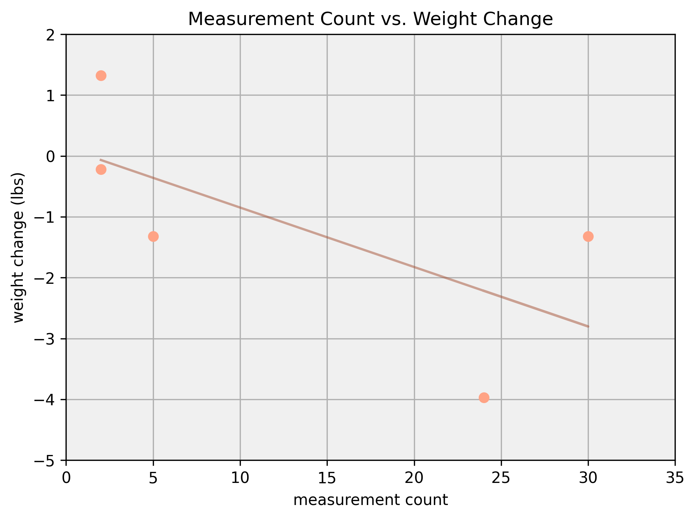

The graph shows that there was a weak negative correlation between the number of weight measurements taken and a decrease in weight. As measurement count increased, weight change tended to decrease.

### Heart Rate Data

#### Research Questions

1. [What was the average heart rate across users?](#what-was-the-average-heart-rate-across-users)
2. [How did the average heart rate change throughout the day?](#how-did-the-average-heart-rate-change-throughout-the-day)

#### What was the average heart rate across users?

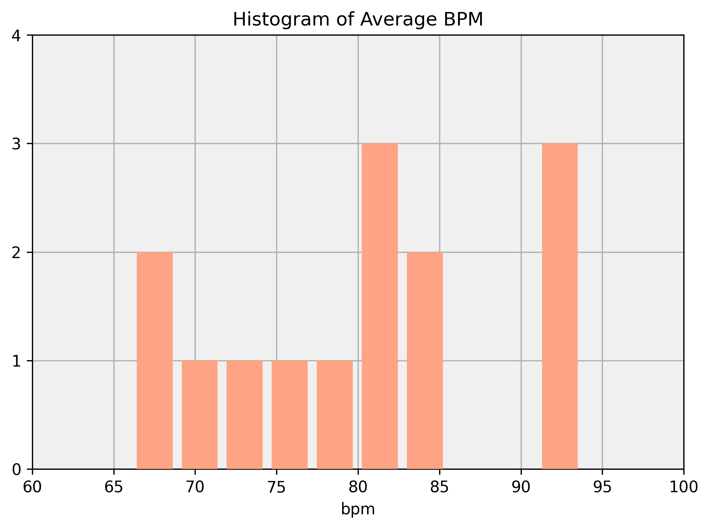

Of the 33 users in the sample, 14 monitored their heart rate. The average across those 14 users was 80 beats per minute.

#### How did the average heart rate change throughout the day?

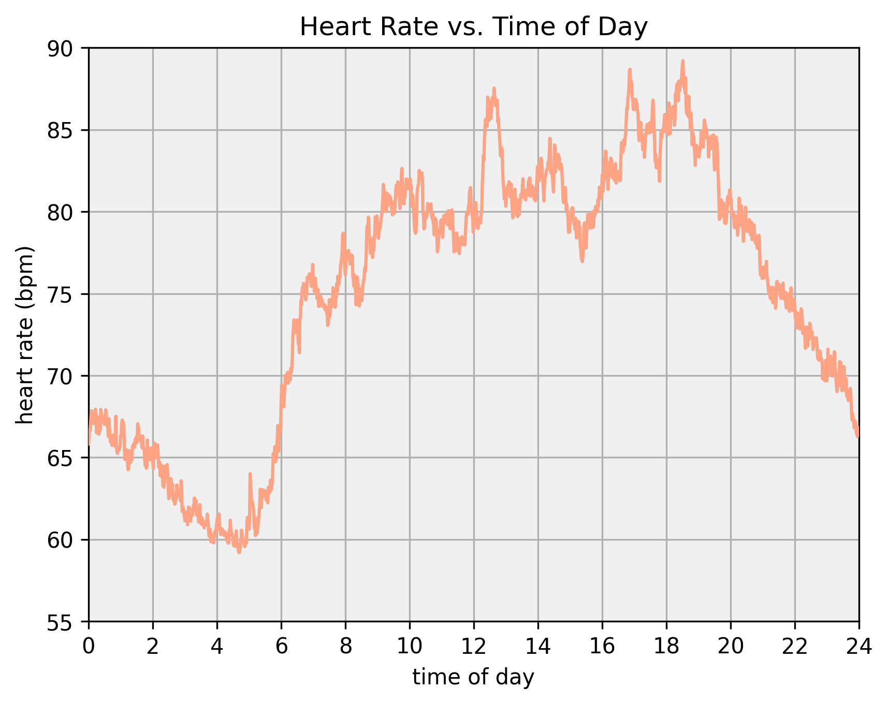

The heart rate data shows a similar trend to the activity metrics versus time of day graphs above. We can see that there is a gradual decline in heart rate from midnight until 5 a.m. After which, there is a steep climb until around 7 a.m., which becomes more gradual until 10 a.m. After 10 a.m., heart rate declined slightly until just before midday, at which point it spiked, only to continue rising until 2 p.m. At 3 p.m., there is a small trough, followed by a gradual increase until just before 7 p.m. Finally, heart rate declines rapidly through midnight until 5 a.m.

## Insights & Recommendations

Presumably, when a person makes a decision to buy a Fitbit, it is because they want a watch that does more than tell the time. However, the ability of smart devices to provide actionable insights to users depends on the quality of the data they collect. If the user does not wear the device, the device cannot collect data. That is, of course, unless the user adds the data herself.

Only 3.4 % of all records contain manually-added data and only 12.1 % of users made a single manual entry. Users may not manually add data for several reasons: they wear their Fitbits constantly (so they don't need to add data manually), they forget to record exercise done without their devices, they deem certain distances insignificant, or they find data entry too burdensome. 

Given Fitbit's limited battery life and users' habits, the first reason is less likely. More plausible are the other three scenarios. If forgetfulness is the primary issue, Bellabeat can send reminders to users to input missing data with app notifications. On the other hand, if users seldom move without the device, any data discrepancies should be minimal. Finally, user-friendly designs could make inputting data manually less of a chore.

Many of the metrics that are collected by Fitbit devices are calculations based on personal data provided by the user. MET ratings, physical activity intensity scores and the number of calories expended are among them. For example, users add their height, weight, age and gender, then the device utilizes those statistics, combined with heart rate information and movement data collected by the device, to calculate an MET rating, which it then assigns to a timestamp. 

The formulae used by Fitbit to calculate these metrics are not publicly available, as it is part of Fitbit's proprietary algorithms, but the efficacy of any smart device to the user will depend on its ability to infer other metrics indirectly. Typically, the data collected and the calculations made by the device are approximations. Collecting accurate data requires more advanced equipment, which is usually inconvenient to wear for any length of time. Most smart devices are a trade-off between convenience and curiosity: We want to know what is going on in our body, but only if it can be done practically.

Using the Fitbit data, we were able to discover more about the routine of the users in our sample. However, we have to reiterate the significance of the small sample size. Any insights about consumer behaviour or activity metrics are unlikely to be representative of the population of wearable owners. Nevertheless, we can at least highlight areas of interest for future studies. 

The users seemed to wake up no earlier than 5 a.m. and would gradually become more active until around 3 p.m., when their activity would decline slightly. This may be because most people do not work out on a full stomach, and so post-lunch workouts were rare. The exercise metrics then continued to rise until around 7 p.m., when they began to decline rapidly. Many users likely finished work around 5 p.m., then went to the gym. After that, people normally have dinner, so workouts in the evening were rare. 

These observations can help Bellabeat time their notifications to coincide with peak exercise times. That way, users may already be thinking about their health, and so they may be more likely to pay attention to the notification.

Very few users tracked their weight during the sample period. This could be because they did not have access to a weighing scale, or they had access, but did not input the data into the app. Smart scales, which interact automatically with a user's smartphone, are becoming increasingly popular. By eliminating the need to enter the data manually, consumers may find themselves more drawn to the idea of owning a smart scale.

Even though the sample size for the dataset was small, the number of users that monitored their weight was even smaller. There was a weak correlation between the number of weight measurements and weight loss. In itself, this does not tell us much, but it may be worthwhile to investigate this correlation with larger samples. A lack of awareness may cause weight gain, as people tend to become overweight gradually over a period of months or years.

Not all users monitored their sleep patterns, but monitoring sleep may not always be helpful. Users that monitored their sleep for more than half the month tended to sleep for longer at night than those that monitored their sleep less. However, users that monitored their sleep too diligently seem to have slept about as much as those that monitored it rarely.

The fluctuations in sleep patterns should be investigated in larger samples, but there could be some interesting insights there. Sleep anxiety is a relatively common problem, caused by a person worrying about not getting enough sleep. If a person is constantly monitoring the way they sleep, they may begin to try and control all the variables involved in detail. Ironically, the consequence could be that the person ends up sleeping less.

Finally, there was no demographic information available on the users in the dataset. Therefore, we cannot conclude what proportion of the users were women, and whether their usage differed from that of men. Future studies will need to focus on exercise data from women in order to provide the most relevant insights to Bellabeat.

## Conclusion

In conclusion, the analysis of Fitbit user data has provided valuable insights into user behavior and preferences, offering actionable recommendations for the marketing strategies of Bellabeat. While the small sample size limits the generalizability of the findings, they serve as a starting point for further exploration. The key takeaways include the importance of user-friendly designs, convenient data entry options, optimized notification timings, promoting the benefits of weight monitoring and smart scales, and addressing sleep-related concerns.

However, it is important to acknowledge the limitation of missing demographic information in the dataset. Without information on the proportion of female users and potential differences in their usage patterns, further research focusing on exercise data from women is needed to provide more relevant and inclusive insights to Bellabeat.
